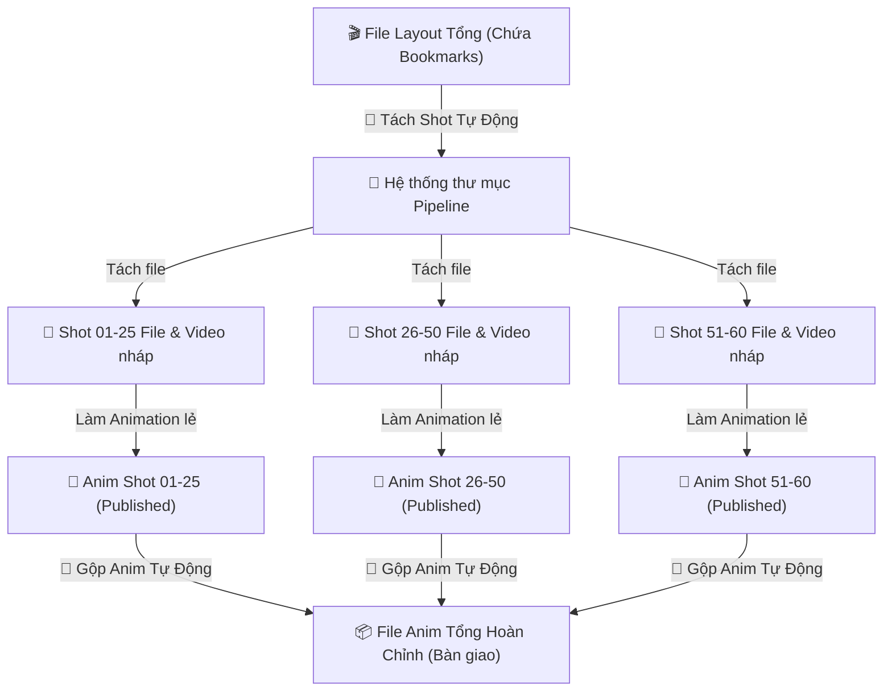

# Brainstorming: Tích hợp Quy trình Tách/Gộp Shot (Split & Combine) vào Pipeline

Dựa trên mã nguồn của công cụ `Smart Bookmark` hiện tại và quy trình làm việc thực tế của dự án **Enjo**, chúng tôi đề xuất phương án tích hợp và tự động hóa quy trình **Tách (Split) và Gộp (Combine) Shot** đồng bộ trực tiếp với hệ thống thư mục của **Animeow Enjo Pipeline**.

---

## 🔄 Luồng Công Việc Đề Xuất (Workflow)



---

## 💡 Các Ý Tưởng Triển Khai Chi Tiết

### 1. Tách (Split) Layout Tổng Tự Động Theo Đúng Pipeline
* **Vấn đề của Tool cũ:** Artist phải chọn thư mục lưu thủ công (`cmds.fileDialog2`), dễ dẫn đến việc chọn sai thư mục hoặc đặt tên file shot lẻ lệch quy chuẩn của server.
* **Giải pháp Pipeline:** Tích hợp nút **"Tách Shot từ Layout Tổng"** trong công cụ:
  * Tool tự động quét toàn bộ các `timeSliderBookmark` trên timeline của file Layout tổng.
  * Tự động tạo ra các thư mục con tương ứng trên Pipeline (ví dụ: `WorkingFile/Layout/[Shot_Name]/file/`).
  * Thực hiện cắt keyframes ngoài khoảng bookmark (`cmds.cutKey`) và thiết lập playback range cho từng shot.
  * Tự động lưu file thành đúng tên quy chuẩn (ví dụ: `KS_ESS_V02_Shot_31-60_Lay_v01.ma`) trực tiếp vào thư mục con của shot đó mà không cần bất kỳ sự can thiệp thủ công nào từ artist.

---

### 2. Gộp (Combine) Linh Hoạt Theo Cụm / Block Tùy Chỉnh
Đây là yêu cầu vô cùng thực tế và thông minh để giải quyết vấn đề file scene quá nặng khi làm việc với các tập phim dài (ví dụ 60 shot). Tool sẽ hỗ trợ **3 chế độ gộp cụm** linh hoạt:
* **Chế độ A: Nhập chuỗi phân nhóm thủ công (Linh hoạt nhất):** Nhập `1-10, 11-20, ...` tool sẽ tự động xuất ra các file gộp cụm tương ứng.
* **Chế độ B: Chia đều tự động** theo số lượng shot chỉ định.
* **Chế độ C: Tích chọn trực quan** các shot trên bảng danh sách của tool.

---

### 3. Giải Pháp Tận Dụng Studio Library & Tự Động Bake Constrains

Để đảm bảo việc chuyển giao chuyển động (copy/paste anim) diễn ra siêu tốc và không bị lỗi lệch khớp vị trí do các ràng buộc ràng buộc (constrains) khác nhau giữa các file:

#### 3.1. Tự động Phát hiện và Bake Constrains
* **Vấn đề:** Các artist Anim thường constrain tay nhân vật vào đồ vật (súng, cốc, tay vịn) hoặc constrain các control lẫn nhau. Khi copy anim thô (curve keys) sang file gộp tổng thiếu các constrain này, nhân vật sẽ bị lỗi vị trí nghiêm trọng.
* **Giải pháp tự động hóa:** Trước khi xuất anim từ file lẻ, tool sẽ tự động chạy ngầm:
  1. Quét toàn bộ các control/object của nhân vật được chọn.
  2. Phát hiện các node constrain liên kết (`parentConstraint`, `pointConstraint`, `orientConstraint`...).
  3. Tự động gọi lệnh **Bake Simulation** của Maya trên đúng các control bị ảnh hưởng đó:
     ```python
     cmds.bakeResults(
         controls_to_bake,
         time=(start_frame, end_frame),
         simulation=True,
         removeConstraint=True  # Rút phích cắm constrain sau khi bake
     )
     ```
  4. Việc này chuyển hóa toàn bộ chuyển động của constrain thành các keyframe tuyệt đối trên từng frame. Control lúc này trở nên độc lập, sẵn sàng để copy sang file tổng an toàn 100%.

#### 3.2. Dọn dẹp keyframe lố ngoài timeline (Clean Keys)
* **Vấn đề:** Animator thường làm lố anim trước/sau timeline (ví dụ shot là 101-200 nhưng họ key từ 95-205).
* **Giải pháp xử lý:**
  * **Cắt key cứng (Hard Cut):** Khi xuất anim, tool chỉ lấy key trong khoảng Bookmark `[start_frame, end_frame]`.
  * **Xuất lấn biên an toàn (Safety Padding):** Để đảm bảo quán tính chuyển động tại điểm giao thoa giữa các shot mượt mà nhất (không bị giật khựng), tool sẽ tự động xuất lấn biên thêm **+/- 5 hoặc 10 frames** (ví dụ xuất từ 95 đến 205).
  * Khi import vào file cụm tổng, tool sẽ chèn keyframe và tự động dọn dẹp (xóa) toàn bộ các key ngoài khoảng cụm đó bằng lệnh `cmds.cutKey` để file tổng luôn sạch sẽ.

#### 3.3. Tận dụng API Studio Library cho việc Copy/Paste siêu tốc
* **Studio Library** chạy rất nhanh vì nó xuất dữ liệu anim trực tiếp thành các file text dictionary có cấu trúc cực nhẹ (lưu tangent, weight, values của key) thay vì ghi file Maya nặng.
* Do Studio Library đã được tích hợp sẵn trong source của bạn tại `AnimeowTool/SourceTool/studiolibrary`, tool Pipeline có thể **gọi trực tiếp API Python của Studio Library chạy ngầm (API Mode)** để thực hiện việc export/import anim nhanh chóng mà không cần artist phải mở giao diện Studio Library lên bấm tay:
  ```python
  # Gọi ngầm Studio Library để xuất anim siêu tốc ra file tạm
  from studiolibrary.packages import studioanim
  studioanim.anim.write(filepath, objects=selected_controls, time=(start, end))
  ```

---

## 🛠️ Đề Xuất Giao Diện Tích Hợp (UI Tab mới)

Chúng ta có thể thêm một Tab mới bên cạnh Tab **Quản Lý File** hiện tại gọi là **"Tách/Gộp Cảnh (Split & Merge)"**:

| Giao Diện Thiết Kế Đề Xuất |
| :--- |
| **TAB: TÁCH / GỘP CẢNH**<br><br>  **[ Khu vực 1: Tách Shot Layout Tổng ]**<br>  * Đọc bookmarks từ scene hiện tại: **[Quét Bookmarks]**<br>  * Danh sách bookmark tìm thấy: *Shot_01-25 (1-100), Shot_26-50 (101-250)...*<br>  * Chọn các control nhân vật cần giữ key: `[ Chọn Control Nhân Vật ]`<br>  * **[ 🚀 Bắt đầu Tách và đồng bộ Pipeline (1 Click) ]**<br><br>  **[ Khu vực 2: Gộp Animation Cảnh Tổng ]**<br>  * Phương thức gộp: `(o) Studio Library API`  hoặc  `( ) Import ATOM`<br>  * Cấu hình an toàn: `[x]` Tự động Bake Constrains  `[x]` Thêm +/- `5` frame đệm (Padding)<br>  * Chọn kiểu chia Block:<br>    - `[x]` Tự gõ Block: `1-10, 11-20, 21-30, 31-45, 46-60`<br>    - `[ ] Chia đều`: `10` shot một file<br>  * **[ 📦 Tiến hành Gộp Cảnh & Xuất File Cụm Bàn Giao ]** |
