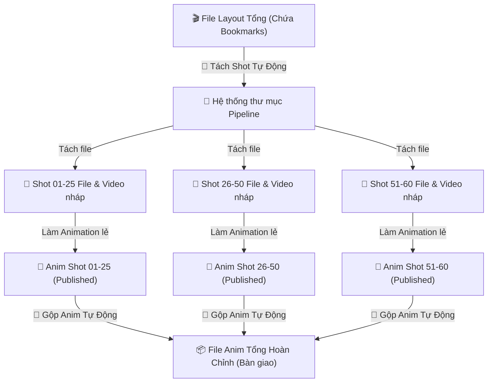

# Brainstorming: Tích hợp Quy trình Tách/Gộp Shot (Split & Combine) vào Pipeline

Dựa trên mã nguồn của công cụ `Smart Bookmark` hiện tại và quy trình làm việc thực tế của dự án **Enjo**, chúng tôi đề xuất phương án tích hợp và tự động hóa quy trình **Tách (Split) và Gộp (Combine) Shot** đồng bộ trực tiếp với hệ thống thư mục của **Animeow Enjo Pipeline**.

---

## 🔄 Luồng Công Việc Đề Xuất (Workflow)



---

## 💡 Các Ý Tưởng Triển Khai Chi Tiết

### 1. Tách (Split) Layout Tổng Tự Động Theo Đúng Pipeline
* **Vấn đề của Tool cũ:** Artist phải chọn thư mục lưu thủ công (`cmds.fileDialog2`), dễ dẫn đến việc chọn sai thư mục hoặc đặt tên file shot lẻ lệch quy chuẩn của server.
* **Giải pháp Pipeline:** Tích hợp nút **"Tách Shot từ Layout Tổng"** trong công cụ:
  * Tool tự động quét toàn bộ các `timeSliderBookmark` trên timeline của file Layout tổng.
  * Tự động tạo ra các thư mục con tương ứng trên Pipeline (ví dụ: `WorkingFile/Layout/[Shot_Name]/file/`).
  * Thực hiện cắt keyframes ngoài khoảng bookmark (`cmds.cutKey`) và thiết lập playback range cho từng shot.
  * Tự động lưu file thành đúng tên quy chuẩn (ví dụ: `KS_ESS_V02_Shot_31-60_Lay_v01.ma`) trực tiếp vào thư mục con của shot đó mà không cần bất kỳ sự can thiệp thủ công nào từ artist.

---

### 2. Gộp (Combine) Linh Hoạt Theo Cụm / Block Tùy Chỉnh
Đây là yêu cầu vô cùng thực tế và thông minh để giải quyết vấn đề file scene quá nặng khi làm việc với các tập phim dài (ví dụ 60 shot). Tool sẽ hỗ trợ **3 chế độ gộp cụm** linh hoạt:
* **Chế độ A: Nhập chuỗi phân nhóm thủ công (Linh hoạt nhất):** Nhập `1-10, 11-20, ...` tool sẽ tự động xuất ra các file gộp cụm tương ứng.
* **Chế độ B: Chia đều tự động** theo số lượng shot chỉ định.
* **Chế độ C: Tích chọn trực quan** các shot trên bảng danh sách của tool.

---

### 3. Giải Pháp Tận Dụng Studio Library & Tự Động Bake Constrains

Để đảm bảo việc chuyển giao chuyển động (copy/paste anim) diễn ra siêu tốc và không bị lỗi lệch khớp vị trí do các ràng buộc ràng buộc (constrains) khác nhau giữa các file:

#### 3.1. Tự động Phát hiện và Bake Constrains (Locator & Object Constrains)
* **Thông tin dự án:** Các artist sử dụng **Reference Rig** để làm việc, chỉ tạo Keyframe trên các Control Curve của Rig đó. Trong quá trình làm, họ thường tạo thêm **Locator** (đồ vật định vị trung gian cục bộ trong file lẻ) để làm điểm neo constrain cho control (ví dụ tay bám theo locator).
* **Vấn đề:** Locator và constrain này chỉ tồn tại trong file Anim lẻ, hoàn toàn không có trong file tổng. Nếu chỉ copy key thô của control, control đó sẽ mất vị trí chính xác khi sang file tổng.
* **Giải pháp tự động hóa:** 
  1. Tool tự động quét toàn bộ các control curve của các **Reference Rig** đang được chọn.
  2. Phát hiện các node constrain liên kết control của Rig với các Locator ngoài (hoặc các vật thể khác).
  3. Tự động gọi lệnh **Bake Simulation** của Maya trên chính các control curve của Reference Rig:
     ```python
     cmds.bakeResults(
         rig_controls_to_bake,
         time=(start_frame, end_frame),
         simulation=True,
         removeConstraint=True  # Rút phích cắm constrain sau khi bake
     )
     ```
  4. **Kết quả:** Toàn bộ chuyển động do Locator constrain tạo ra sẽ được chuyển đổi thành các keyframe tuyệt đối trên các control curve của Rig. Các Locator rác và constrain lúc này có thể được bỏ qua một cách an toàn. File cụm tổng chỉ việc nạp anim của các control curve này là khớp chuyển động chuẩn 100% mà không cần dựng lại bất kỳ constrain hay locator nào!

#### 3.2. Tính Năng Smart Bake (Bake thưa giữ key cực trị)
* **Giải pháp Smart Bake:**
  Chúng ta có thể lập trình thuật toán giảm key thông minh nhằm giữ cho curve anim sạch sẽ nhưng vẫn bảo toàn 100% hình dạng dáng (pose) chuyển động:
  1. **Bước 1: Quét ghi nhớ keypose gốc:** Tool ghi nhận tất cả các frame chứa key pose quan trọng ban đầu do artist đặt thủ công.
  2. **Bước 2: Bake kết quả ở dạng thưa (Sparse Bake):** Chạy lệnh bake kết quả mô phỏng nhưng kích hoạt tuỳ chọn lọc sparse của Maya:
     ```python
     cmds.bakeResults(controls, sparseAnimCurveBake=True)
     ```
  3. **Bước 3: Lọc Keyframe bằng thuật toán Key Reducer:** Gọi bộ lọc key thông minh mặc định của Maya trên các anim curves:
     ```python
     cmds.filterCurve(anim_curves, filter="keyReducer", threshold=0.1)
     ```
     *Bộ lọc này sẽ phân tích độ dốc (tangent) và tự động xoá bỏ toàn bộ các key nằm trên đường cong đều hoặc tuyến tính, nhưng **chắc chắn giữ lại các điểm cực trị (Extreme/Breakdown)** nơi chuyển động đổi hướng hoặc đạt biên độ lớn nhất.*

#### 3.3. Dọn dẹp keyframe lố ngoài timeline (Clean Keys)
* **Quy trình xử lý:**
  * **Xuất lấn biên an toàn (Safety Padding):** Để đảm bảo quán tính chuyển động mượt mà tại điểm giao thoa giữa các shot, tool sẽ tự động xuất lấn biên thêm **+/- 5 hoặc 10 frames** (ví dụ xuất từ 95 đến 205).
  * **Clean Keys (Dọn dẹp):** Sau khi import vào file cụm tổng, tool sẽ tự động chạy lệnh `cmds.cutKey` để cắt bỏ hoàn toàn các key ngoài khoảng biên của cụm đó, đảm bảo file cụm tổng luôn sạch sẽ.

#### 3.4. Đóng gói & Tận dụng API Studio Library cho việc Copy/Paste siêu tốc (Mới)
* **Studio Library** chạy rất nhanh vì nó xuất dữ liệu anim trực tiếp thành các file text dictionary có cấu trúc cực nhẹ (lưu tangent, weight, values của key) thay vì ghi file Maya nặng.
* **Phương pháp đóng gói tích hợp (Packaging):**
  Chúng ta sẽ đưa toàn bộ mã nguồn của Studio Library vào làm một thư viện bên thứ ba (Thirdparty) trực thuộc Pipeline:
  * Thư mục đích: `Animeow_Enjo_Pipeline/thirdparty/studiolibrary/`
  * Khi load tool, Pipeline sẽ tự động thêm thư mục `thirdparty` này vào `sys.path` của Python để sẵn sàng import:
    ```python
    import sys, os
    thirdparty_path = os.path.join(os.path.dirname(__file__), "thirdparty")
    if thirdparty_path not in sys.path:
        sys.path.insert(0, thirdparty_path)
    import studiolibrary
    ```
* **Mức độ tích hợp:**
  1. **Tích hợp chạy ngầm (API Mode - Chính):** Khi artist nhấn nút "Gộp Shot", Pipeline sẽ gọi Python API của Studio Library chạy ngầm bên dưới để xuất/nhập anim siêu tốc mà artist không hề thấy cửa sổ Studio Library xuất hiện. Trải nghiệm người dùng sẽ liền mạch 100%.
  2. **Tích hợp giao diện UI (UI Mode - Phụ):** Bổ sung nút **"Mở thư viện dáng (Studio Library)"** trên giao diện Pipeline để artist có thể khởi chạy nhanh giao diện quản lý pose/anim dùng chung của dự án khi cần.

---

## 🛠️ Đề Xuất Giao Diện Tích Hợp (UI Tab mới)

Chúng ta có thể thêm một Tab mới bên cạnh Tab **Quản Lý File** hiện tại gọi là **"Tách/Gộp Cảnh (Split & Merge)"**:

| Giao Diện Thiết Kế Đề Xuất |
| :--- |
| **TAB: TÁCH / GỘP CẢNH**<br><br>  **[ Khu vực 1: Tách Shot Layout Tổng ]**<br>  * Đọc bookmarks từ scene hiện tại: **[Quét Bookmarks]**<br>  * Danh sách bookmark tìm thấy: *Shot_01-25 (1-100), Shot_26-50 (101-250)...*<br>  * Chọn các control nhân vật cần giữ key: `[ Chọn Control Nhân Vật ]`<br>  * **[ 🚀 Bắt đầu Tách và đồng bộ Pipeline (1 Click) ]**<br><br>  **[ Khu vực 2: Gộp Animation Cảnh Tổng ]**<br>  * Phương thức gộp: `(o) Studio Library API`  hoặc  `( ) Import ATOM`<br>  * Cấu hình an toàn:<br>    - `[x]` Tự động Bake Constrains (Locator/Rig)<br>    - `[x]` Chế độ Smart Bake (Bake thưa giữ key cực trị)<br>    - `[x]` Thêm +/- `5` frame đệm (Padding)<br>  * Chọn kiểu chia Block:<br>    - `[x]` Tự gõ Block: `1-10, 11-20, 21-30, 31-45, 46-60`<br>    - `[ ] Chia đều`: `10` shot một file<br>  * **[ 📦 Tiến hành Gộp Cảnh & Xuất File Cụm Bàn Giao ]**<br><br>  **[ Khu vực 3: Tiện ích ]**<br>  * **[ 📖 Mở Studio Library UI ]**  * **[ 🎬 Xem Keyframe Bookmarks CSV ]** |

---

## 📝 Nhật Ký Phiên Làm Việc (Phiên 7/7/2026 - Đã Đẩy Lên Git)

### 1. Các Cải Tiến Đã Hoàn Thành & Push Git
* **Tối giản hóa giao diện Tab 2:**
  * Loại bỏ ô nhập file Layout tổng và nút Browse.
  * Loại bỏ menu chuột phải "Chuyển sang Tách / Gộp Cảnh" ở Tab 1.
  * Quét bookmark trực tiếp trên scene mở chỉ mất 0.01s.
  * Xóa bỏ tệp quét ngầm `standalone_scan.py` khỏi core.
* **Sửa lỗi dọn dẹp keyframe thừa (100% Sạch):**
  * Quét toàn bộ `animCurve` nodes trong scene (`cmds.ls(type='animCurve')`) để dọn sạch keyframe thừa của mọi đối tượng, bao gồm cả camera shape (`Focal Length`, `Distance`, v.v.) ngoài khoảng range.
  * Bổ sung tham số `option="keys"` và sai số `0.01` trong `cmds.cutKey` để chặn Maya tự động tạo thêm keyframe biên (ở frame 9 hoặc biên của range).
* **Đồng bộ thư mục phân cấp cho Anim:**
  * File lẻ hoạt hình được lưu vào thư mục phân cấp giống Layout: `WorkingFile/Anim/{Tên_Shot}/file/{Tên_Shot}_Anim_v01.ma`.
* **An toàn dữ liệu:**
  * Thêm hộp thoại confirm cảnh báo trùng file nháp hoạt hình trên đĩa để chống ghi đè làm mất công sức của artist (chọn *Ghi đè*, *Bỏ qua*, hoặc *Hủy bỏ*).

### 2. Định Hướng Phiên Làm Việc Sau (Brainstorming - Studio Library API)
Nhằm giải quyết bài toán "không cần mở file vẫn gộp được" và nâng cao tính ổn định của quy trình Gộp Cảnh (Combine), chúng ta thống nhất sẽ chuyển sang **luồng làm việc qua Studio Library trung gian**:

#### 📤 A. Khi ở File Lẻ (Publish Animation)
1. Artist làm Anim xong trên file lẻ.
2. Bấm nút **"Publish Anim của File lẻ lên Server"**.
3. Tool tự động nhận diện tên shot, quét controls có key (Smart Selection) và gọi API `mutils.saveAnim(...)` xuất thành tệp chuyển động `.anim` trên server:
   `Z:/Animeow_Production/{Project}/{Episode}/Published/StudioLibrary/{Shot_Name}.anim`

#### 📥 B. Khi ở File Tổng (Import/Combine)
1. Artist mở file Cảnh tổng.
2. Tích chọn các shot lẻ cần gộp trên bảng danh sách của Tool.
3. Bấm nút **"Import Anim từ Server về Cảnh tổng"**.
4. Tool tự tìm đúng tệp `.anim` tương ứng của shot trên server, tự động map namespace trong scene tổng và dán đè keyframe hoạt hình vào đúng vị trí timeline của bookmark đó qua API `mutils.loadAnims(...)`.

